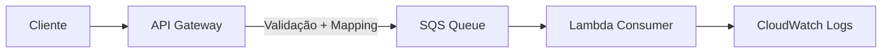

## 🚀 Etapas Implementadas (até o momento)

Este projeto implementa uma arquitetura serverless na AWS para processamento de pedidos, utilizando serviços desacoplados e orientados a eventos.

### ✅ Etapa 1 — SQS + Lambda (Consumer)

- Criação de uma fila SQS para recebimento de pedidos
- Implementação de uma função Lambda em Python para consumir mensagens da fila
- Processamento inicial do payload recebido
- Logs estruturados no CloudWatch

---

### ✅ Etapa 2 — API Gateway → SQS

- Criação de uma API REST com endpoint:
`POST /orders`


- Integração direta entre API Gateway e SQS (sem uso de Lambda)
- Uso de **Mapping Template (VTL)** para transformar JSON em formato compatível com SQS
- Configuração de permissões via IAM Role
- Implementação de **Request Validator** para validação do payload
- Definição de **Model (JSON Schema)** para garantir estrutura da requisição

#### 📥 Exemplo de requisição

```json
{
"orderId": "1",
"product": "Mouse",
"price": 99
}
```
#### ✅ Comportamento
- Requisições válidas são enviadas para o SQS
- Requisições inválidas são rejeitadas com erro 400
- A Lambda é acionada automaticamente via SQS

### 🧩 Arquitetura Atual



### 🧠 Conceitos aplicados
- Arquitetura orientada a eventos
- Desacoplamento via mensageria
- Validação na borda (API Gateway)
- Infraestrutura como código (Terraform)
- Integração direta entre serviços AWS (sem Lambda intermediária)

### 💰 Considerações sobre Free Tier
- API Gateway: até 1 milhão de requisições/mês
- SQS: até 1 milhão de requisições/mês
- Lambda: até 1 milhão de execuções/mês

Toda a arquitetura foi pensada para operar dentro dos limites do Free Tier.